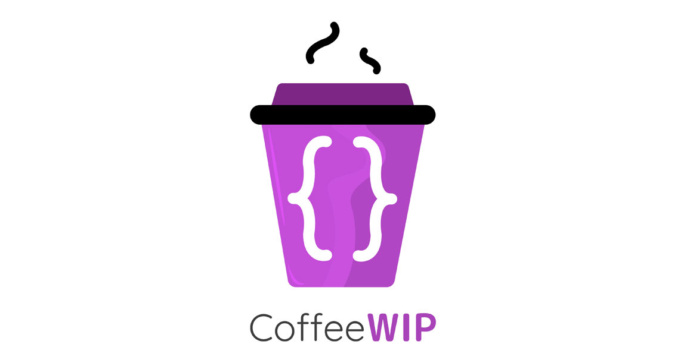

# CoffeeWIP Website

## 🔖 Description

La página web esta desarrollada en ReactJS y NextJS y el gestor de paquetes utilizados es NPM.

Para la definición de componentes, servicios, etc., se emplea functional programming evitando la creación de clases.

## 📐 How to work with this project

Debes de seguir los siguientes pasos para poder trabajar en local.

### 1️⃣ Install NodeJS Dependencies

En primer lugar es necesario instalar las dependencias del proyecto.

```bash
npm install
```

### 2️⃣ Run HTTP Server with or whithout Cluster

Y después lanzar el servidor local, que por defecto será accesible desde la url: [http://localhost:3000](http://localhost:3000). Para ello es necesario lanzar el siguiente commando:

```bash
npm run dev
```

## 🐋 Docker version

Build image locally and run it
```
docker build . -t coffewip-website
docker run -p 3000:3000 coffewip-website
# Browse http://127.0.0.1:3000
```

## 📂 Code Scaffolding

```any
/
├── assets 🌈                   # Images Sources.
├── components                  # Components.
├── env                         # Environments.
├── pages                       # Static pages.
├── public                      # Root files.
├── src                         # Server Application.
├── ui-kit                      # Style kit.
└── ...
```

## ⛽️ Review and Update Dependences

For review and update all npm dependences of this project you need install in global npm package "npm-check-updates" npm module.

```bash
# Install and Run
$npm i -g npm-check-updates
$ncu
```

## Happy Code

Created with JavaScript, lot of ❤️ and a few ☕️

## This README.md file has been written keeping in mind

[GitHub Markdown](https://guides.github.com/features/mastering-markdown/) \
[Emoji Cheat Sheet](https://www.webfx.com/tools/emoji-cheat-sheet/)
